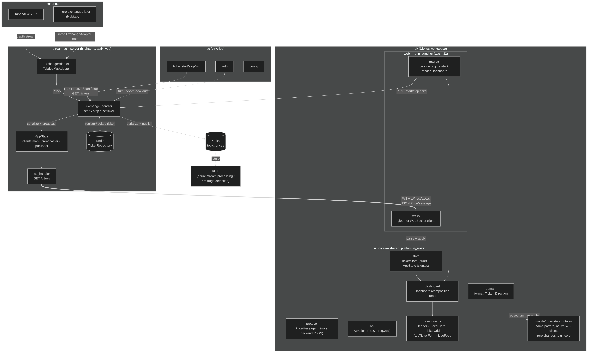
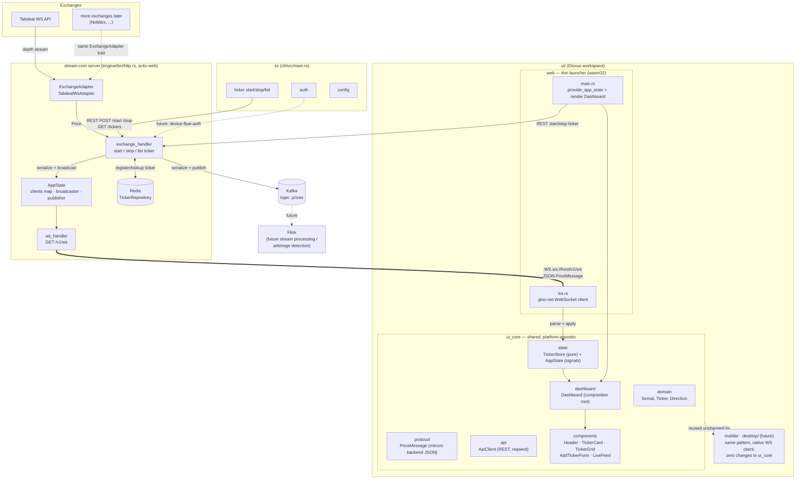

# stream-coin Architecture

Arbitrage engine for Iranian cryptocurrency exchanges. One backend (Rust/actix-web),
fed by per-exchange WebSocket adapters, exposing a REST control-plane + a real-time
WebSocket feed, consumed by a CLI (`sc`) and a cross-platform UI (Dioxus).

## System diagram

Mermaid source

## Components

| Layer | Crate / module | Responsibility |
|---|---|---|
| Exchange adapters | `engine/src/exchange/*` | One adapter per exchange implementing `ExchangeAdapter`; parses exchange-specific WS messages into the shared `Price` type. |
| Control plane | `engine/src/presentation/handlers/exchange_handler.rs` | REST: start/stop/list tickers. On every price tick: publishes to Kafka **and** broadcasts to WS clients. |
| Real-time feed | `engine/src/presentation/handlers/ws_handler.rs` | `GET /v1/ws` — upgrades to WebSocket, forwards every `AppState::broadcaster` message to the client; answers ping/close. |
| Shared state | `engine/src/presentation/shared/app_state.rs` | `clients` (running ticker handles), `broadcaster` (`tokio::broadcast`), `publisher` (Kafka), `ticker_repository` (Redis). |
| Cache | `engine/src/infrastructure/cache/*` | Redis-backed `TickerRepository`. |
| Messaging | `engine/src/kafka/*` | `MessagePublisher` port + `KafkaProducer` adapter (rdkafka). |
| CLI | `cli/src/*` | `sc auth/ticker/config` — talks to the same REST control plane as the UI; zero dependency on `engine`. |
| UI shared core | `ui/ui_core/*` | Domain logic, wire protocol, reactive state, REST client, all Dioxus components, and the `Dashboard` composition — platform-agnostic, unit tested without WASM. |
| UI web launcher | `ui/web/*` | Thin binary: provides `AppState`, runs the `gloo-net` WebSocket client (`ws.rs`), renders `Dashboard`. |
| UI future platforms | `ui/mobile/`, `ui/desktop/` (not yet created) | Same pattern as `ui/web`: own `Cargo.toml`, own native WS transport, depends on `ui_core`, zero changes to shared code. |

## Data flow (one price tick)

1. `TabdealWsAdapter` reads a depth message from the exchange's WebSocket and parses it into a `Price`.
2. `exchange_handler` receives the `Price` over an internal `mpsc` channel.
3. It serializes the price once (`KafkaProducer::price_to_payload`) and:
   - publishes it to the `prices` Kafka topic (for future Flink/arbitrage processing), and
   - sends it on `AppState::broadcaster` (a `tokio::sync::broadcast` channel).
4. Every connected `ws_handler` session (one per browser tab) receives the broadcast and forwards it as a WS text frame.
5. The UI's `ws.rs` (web) parses it into `PriceMessage`, calls `AppState::apply_price`, which updates `TickerStore` (ticker map, flash direction, capped live-feed list) — Dioxus signals re-render the affected components automatically.

## Extension points

- **New exchange**: implement `ExchangeAdapter` for it (see `engine/src/exchange/tabdeal/`), register it in `engine/bin/http.rs`'s adapter map. Nothing else changes.
- **New UI platform** (Android/desktop): add `ui/mobile/` (or `desktop/`) with its own `Cargo.toml` + native WebSocket transport module (mirroring `ui/web/src/ws.rs`), depend on `ui_core`, call `provide_app_state()` + render `Dashboard`. No changes to `ui_core`.
- **Arbitrage detection**: consume the `prices` Kafka topic (directly or via Flink), compare prices across exchanges for the same pair, publish opportunities to a new topic/endpoint.
- **Auth**: `sc auth` and the REST handlers already have the shape for it (`AppState`, CLI `auth` module); wiring a real device-flow/JWT is additive, not a redesign.
